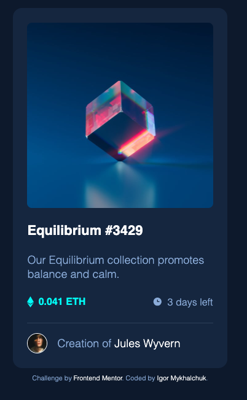
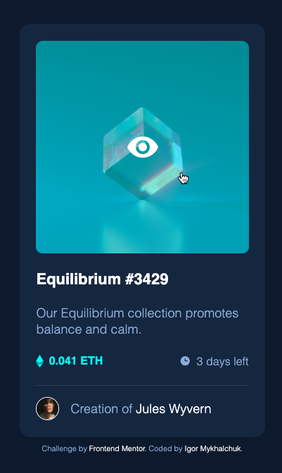
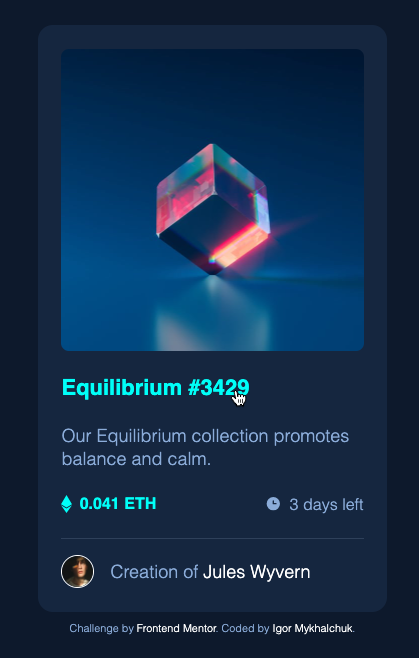
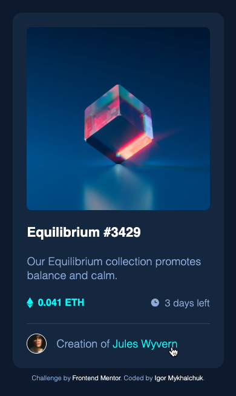
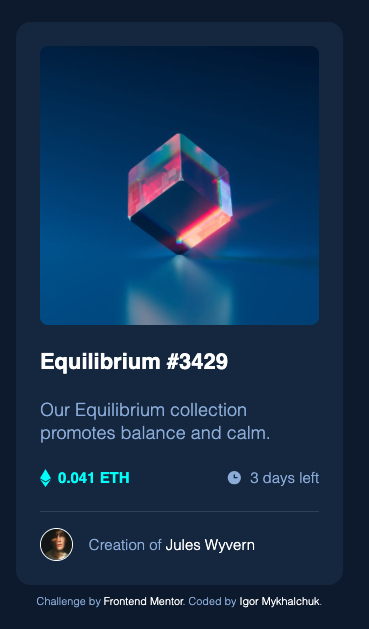

# Frontend Mentor - NFT preview card component solution

This is a solution to the [NFT preview card component challenge on Frontend Mentor](https://www.frontendmentor.io/challenges/nft-preview-card-component-SbdUL_w0U). Frontend Mentor challenges help you improve your coding skills by building realistic projects.

## Table of contents

- [Overview](#overview)
  - [The challenge](#the-challenge)
  - [Screenshots](#screenshot)
  - [Links](#links)
  - [Built with](#built-with)

## Overview

The challenge was to build out this product review card and get it looking as close as possible to the mobile and desktop designs inside the `/design` folder.

All the required assets for this project are in the `/design` folder. The images are already exported for the correct screen size and optimized. The starter code also include variable and static font files for the required fonts for this project. There is also a `style-guide.md` file containing the information you'll need, such as color palette and fonts.

### The challenge

Users should be able to:

- View the optimal layout for the interface depending on their device's screen size
- See hover and focus states for all interactive elements on the page

### Screenshots

Desktop:

Desktop active:

Desktop active:

Desktop active:

Mobile:

### Built with

- Semantic HTML5 markup
- CSS custom properties
- Flex
- Media queries
- Visual Studio Code
